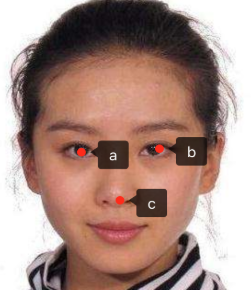

# 基于mtcnn与facenet实现人脸登录系统

本文主要介绍了系统涉及的人脸检测与识别的详细方法，该系统基于python2.7.10/opencv2/tensorflow1.7.0环境，实现了从摄像头读取视频，检测人脸，识别人脸的功能
由于模型文件过大，git无法上传，整个项目放在百度云盘，地址:https://pan.baidu.com/s/1TaalpwQwPTqlCIfXInS_LA


人脸识别是计算机视觉研究领域的一个热点。目前，在实验室环境下，许多人脸识别已经赶上（超过）人工识别精度（准确率：0.9427~0.9920），比如face++,DeepID3，FaceNet等（详情可以参考：基于深度学习的人脸识别技术综述）。但是，由于光线，角度，表情，年龄等多种因素，导致人脸识别技术无法在现实生活中广泛应用。本文基于python/opencv/tensorflow环境，采用FaceNet（LFW：0.9963 ）为基础来构建实时人脸检测与识别系统，探索人脸识别系统在现实应用中的难点。下文主要内容如下 ：

1. 利用htm5 video标签打开摄像头采集头像并使用jquery.faceDeaction组件来粗略检测人脸
2. 将人脸图像上传到服务器，采用mtcnn检测人脸
3. 利用opencv的仿射变换对人脸进行对齐，保存对齐后的人脸
4. 采用预训练的facenet对检测的人脸进行embedding，embedding成512维度的特征；
5. 对人脸embedding特征创建高效的annoy索引进行人脸检测


### 人脸采集
采用html5 video标签可以很方便的实现从摄像头读取视频帧，下文代码实现了从摄像头读取视频帧，faceDection识别人脸后截取图像上传到服务器功能
在html文件中添加video，canvas标签
```$xslt
<div class="booth">
    <video id="video" width="400" height="300" muted class="abs" ></video>
    <canvas id="canvas" width="400" height="300"></canvas>
  </div>
```
打开网络摄像头
```$xslt
var video = document.getElementById('video'),
var vendorUrl = window.URL || window.webkitURL;
//媒体对象
navigator.getMedia = navigator.getUserMedia || navagator.webkitGetUserMedia || navigator.mozGetUserMedia || navigator.msGetUserMedia;
navigator.getMedia({video: true, //使用摄像头对象audio: false  //不适用音频}, function(strem){
    video.src = vendorUrl.createObjectURL(strem);
    video.play();
});
```
利用jquery的facetDection组件检测人脸

> $('#canvas').faceDetection()

检测出人连脸的话截图，并把图片转换为base64的格式，方便上传

```$xslt
context.drawImage(video, 0, 0, video.width, video.height);
var base64 = canvas.toDataURL('images/png');
```

将base64格式的图片上传到服务器
```$xslt
//上传人脸图片
function upload(base64) {
  $.ajax({
      "type":"POST",
      "url":"/upload.php",
      "data":{'img':base64},
      'dataType':'json',
      beforeSend:function(){},
      success:function(result){
          console.log(result)
          img_path = result.data.file_path
      }
  });
}
```
图片服务器接受代码，php语言实现
```$xslt
function base64_image_content($base64_image_content,$path){
    //匹配出图片的格式
    if (preg_match('/^(data:\s*image\/(\w+);base64,)/', $base64_image_content, $result)){
        $type = $result[2];
        $new_file = $path."/";
        if(!file_exists($new_file)){
            //检查是否有该文件夹，如果没有就创建，并给予最高权限
            mkdir($new_file, 0700,true);
        }
        $new_file = $new_file.time().".{$type}";
        if (file_put_contents($new_file, base64_decode(str_replace($result[1], '', $base64_image_content)))){
            return $new_file;
        }else{
            return false;
        }
    }else{
        return false;
    }
}
```

### 人脸检测

人脸检测方法有许多，比如opencv自带的人脸Haar特征分类器和dlib人脸检测方法等。
对于opencv的人脸检测方法，有点是简单，快速；存在的问题是人脸检测效果不好。正面/垂直/光线较好的人脸，该方法可以检测出来，而侧面/歪斜/光线不好的人脸，无法检测。因此，该方法不适合现场应用。对于dlib人脸检测方法 ，效果好于opencv的方法，但是检测力度也难以达到现场应用标准。
本文中，我们采用了基于深度学习方法的mtcnn人脸检测系统（mtcnn：Joint Face Detection and Alignment using Multi-task Cascaded Convolutional Neural Networks）。mtcnn人脸检测方法对自然环境中光线，角度和人脸表情变化更具有鲁棒性，人脸检测效果更好；同时，内存消耗不大，可以实现实时人脸检测。本文中采用mtcnn是基于python和tensorflow的实现（代码来自于davidsandberg，caffe实现代码参见：kpzhang93）
```$xslt
model= os.path.abspath(face_comm.get_conf('mtcnn','model'))
class Detect:
    def __init__(self):
        self.detector = MtcnnDetector(model_folder=model, ctx=mx.cpu(0), num_worker=4, accurate_landmark=False)
    def detect_face(self,image):
        img = cv2.imread(image)
        results =self.detector.detect_face(img)
        boxes=[]
        key_points = []
        if results is not None:  
            #box框
            boxes=results[0]
            #人脸5个关键点
            points = results[1]
            for i in results[0]:
                faceKeyPoint = []
                for p in points:
                    for i in range(5):
                        faceKeyPoint.append([p[i], p[i + 5]])
                key_points.append(faceKeyPoint)
        return {"boxes":boxes,"face_key_point":key_points}
```
具体代码参考fcce_detect.py

### 人脸对齐

有时候我们截取的人脸了头像可能是歪的，为了提升检测的质量，需要把人脸校正到同一个标准位置，这个位置是我们定义的，假设我们设定的标准检测头像是这样的



假设眼睛，鼻子三个点的坐标分别是a(10,30) b(20,30) c(15,45)，具体设置可参看config.ini文件alignment快配置项

采用opencv仿射变换进行对齐,获取仿射变换矩阵
```
dst_point=【a,b,c】
tranform = cv2.getAffineTransform(source_point, dst_point)
```

仿射变换:
> img_new = cv2.warpAffine(img, tranform, imagesize)

具体代码参考face_alignment.py文件

### 产生特征

对齐得到后的头像，放入采用预训练的facenet对检测的人脸进行embedding，embedding成512维度的特征，以(id,vector)的形式保存在lmdb文件中
```$xslt
 facenet.load_model(facenet_model_checkpoint)
 images_placeholder = tf.get_default_graph().get_tensor_by_name("input:0")
 embeddings = tf.get_default_graph().get_tensor_by_name("embeddings:0")
 phase_train_placeholder = tf.get_default_graph().get_tensor_by_name("phase_train:0")

 face=self.dectection.find_faces(image)
 prewhiten_face = facenet.prewhiten(face.image)
 # Run forward pass to calculate embeddings
 feed_dict = {images_placeholder: [prewhiten_face], phase_train_placeholder: False}
 return self.sess.run(embeddings, feed_dict=feed_dict)[0]
```

具体代码可参看face_encoder.py


人脸特征索引:

人脸识别的时候不能对每一个人脸都进行比较，太慢了，相同的人得到的特征索引都是比较类似，可以采用KNN分类算法去识别
这里采用是更高效annoy算法对人脸特征创建索引，annoy索引算法的有个假设但就是，每个人脸特诊可以看做是在高维空间的一个点如果两个很接近(相识)，任何超平面
都无法把他们分开，也就是说空间的点如果接近的用超平面去分隔类似的点一定会分在同一个平面空间（具体参看:https://github.com/spotify/annoy）

```$xslt
#人脸特征先存储在lmdb文件中格式(id,vector),所以这里从lmdb文件中加载
lmdb_file = self.lmdb_file
if os.path.isdir(lmdb_file):
    evn = lmdb.open(lmdb_file)
    wfp = evn.begin()
    annoy = AnnoyIndex(self.f)
    for key, value in wfp.cursor():
        key = int(key)
        value = face_comm.str_to_embed(value)
        annoy.add_item(key,value)

    annoy.build(self.num_trees)
    annoy.save(self.annoy_index_path)
```


### 人脸识别
经过上面三个步骤后，得到人脸特征，在索引中查询最近几个点并就按欧式距离，如果距离小于0.6（更据实际情况设置的阈值）则认为是同一个人，然后根据id在数据库查找到对应人的信息即可

```
#根据人脸特征找到相似的
def query_vector(self,face_vector):
    n=int(face_comm.get_conf('annoy','num_nn_nearst'))
    return self.annoy.get_nns_by_vector(face_vector,n,include_distances=True)
```

### 安装部署

系统采用有两个模块组成：

* face_web：提供用户注册登录，人脸采集，php语言实现
* face_server: 提供人脸检测，裁剪，对齐，识别功能，python语言实现

模块间采用socket方式通信通信格式为: length+content

1.使用镜像

* face_serverdocker镜像: shareclz/python2.7.10-face-image
* face_web镜像: skiychan/nginx-php7

假设项目路径为/data1/face-login

2.安装face_server容器
```
docker run -it --name=face_server --net=host  -v /data1:/data1  shareclz/python2.7.10-face-image /bin/bash
cd /data1/face-login
python face_server.py
```

3.安装face_web容器

```
docker run -it --name=face_web --net=host  -v /data1:/data1  skiychan/nginx-php7 /bin/bash
cd /data1/face-login;
php -S 0.0.0.0:9988 -t ./web/ 

```


